## Research-Pathways-for-Newcomers

### 思想准备（思想觉悟不高，路走不长）

- 学到的知识技能是自己的，不是给老师学习的！谢谢！没有这个思想觉悟，可以回炉重造！

- 搞科研、干事情是自驱的，靠别人驱动的，慎重！

### 代码基础（不会Coding，都是扯淡）

近期最基础的代码语言是 Python，Pytorch，TensorFlow 等，但是其他编程语言如 C, C++ 部分环节也是必须的。技多不压身！

* **Python**

  1). [[https://www.w3schools.com/python/](https://www.w3schools.com/python/)]

  2). [[Python 3.13.2 documentation](Python 3.13.2 documentation)]

  
* **PyTorch**
  [[https://pytorch.org/](https://pytorch.org/)]
  [[PyTorch Tutorials](https://pytorch.org/tutorials/)] 
  [[PyTorch Beginner Series (Youtube)](https://www.youtube.com/playlist?list=PL_lsbAsL_o2CTlGHgMxNrKhzP97BaG9ZN)]

  
* 我们小组维护的模型、代码库：[[**EventAHU Group**](https://github.com/Event-AHU)] 

### 数学基础（临时抱佛脚也得抱）
* 高等数学
* 线性代数
* 矩阵分析
* 概率论

### 机器学习课程（基础的东西要深刻掌握）
  
* **《机器学习》 周志华**
  [[pdf](https://jingyuexing.github.io/Ebook/Machine_Learning/%E6%9C%BA%E5%99%A8%E5%AD%A6%E4%B9%A0_%E5%91%A8%E5%BF%97%E5%8D%8E.pdf)]
  
  

  
* **西瓜书** 配套《机器学习》公式推导过程
  [[URL](https://github.com/datawhalechina/pumpkin-book/releases)]
  
  

  
* **《动手学深度学习》第二版** [[https://zh.d2l.ai/](https://zh.d2l.ai/)] **李沐**
  [[PyTorch版本pdf文档](https://zh-v2.d2l.ai/d2l-zh-pytorch.pdf)]
  [[Apache MXNet/Gluon中文频道](https://www.youtube.com/@MXNetGluon/videos)]

  

  
* **神经网络与深度学习** **邱锡鹏** 
  [[官网主页](https://nndl.github.io/)]
  [[pdf](https://nndl.github.io/nndl-book.pdf)]

  
  

* **统计学习方法（第二版）李航**
  [[PDF](https://www.dropbox.com/scl/fi/4qxrioh87i2uuk7iig68p/2-Z-Library.pdf?rlkey=lrnq6qaqfajsfrvmu1wq4iu0o&st=1c012mzb&dl=0)]

  

  

### 预训练大模型（热点技术路线）

* [[《大规模语言模型：从理论到实践》 第二版](https://intro-llm.github.io/)]

  

* [[大语言模型 LLMBook](https://www.datawhale.cn/learn/summary/107)] [[PDF](https://github.com/datawhalechina/llmbook/blob/main/LLMBook.pdf)] [[Bilibili](https://space.bilibili.com/431850986/lists/4940683?type=season)]

  

* [[Awesome-Chinese-LLM](https://github.com/HqWu-HITCS/Awesome-Chinese-LLM)]

  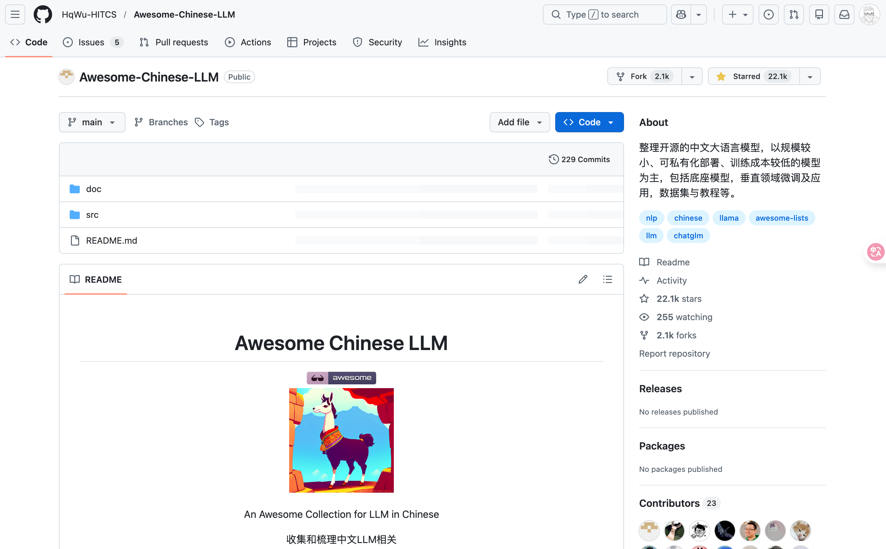

* [[Stanford CME295 Transformers & LLMs | Autumn 2025](https://cme295.stanford.edu/syllabus/)]
  [[Youtube Video List](https://www.youtube.com/playlist?list=PLoROMvodv4rOCXd21gf0CF4xr35yINeOy)]
  
  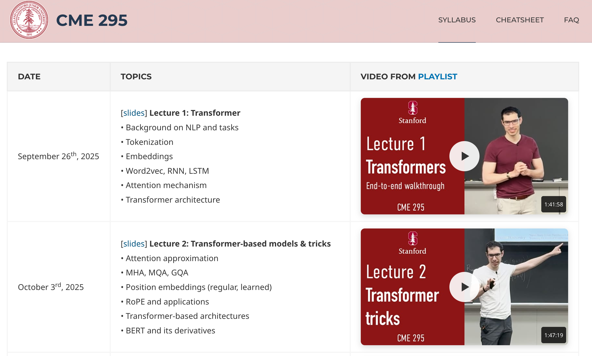

  
* **Build a Large Language Model (From Scratch)**
  [[GitHub](https://github.com/rasbt/LLMs-from-scratch)]

  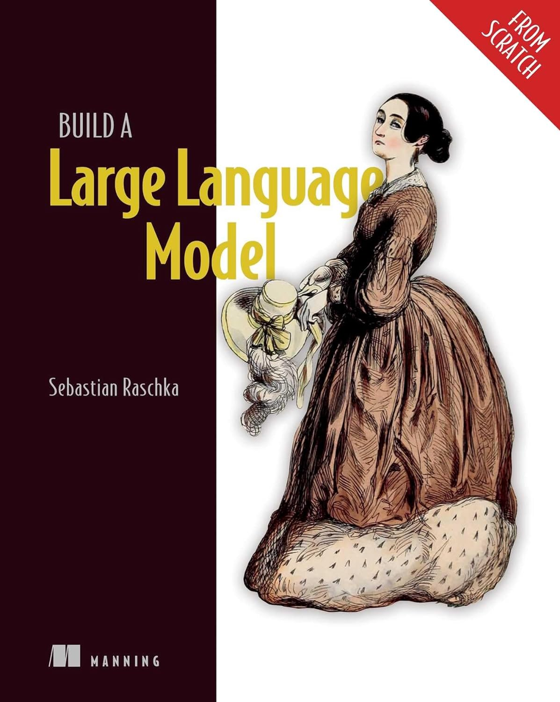

* **Current BestPracticesfor Training LLMsfrom Scratch** Authors: Rebecca Li, Andrea Parker, Justin Tenuto
  [[Current-Best-Practices-for-Training-LLMs-from-Scratch-Final.pdf](https://wandb.ai/site/wp-content/uploads/2023/09/Current-Best-Practices-for-Training-LLMs-from-Scratch-Final.pdf)]

### 深度学习课程（不被AI时代所抛弃，就赶紧整起来吧）

* **MIT 6.S191 Introduction to Deep Learning** [Year 2025] [[Home](https://introtodeeplearning.com/)]

  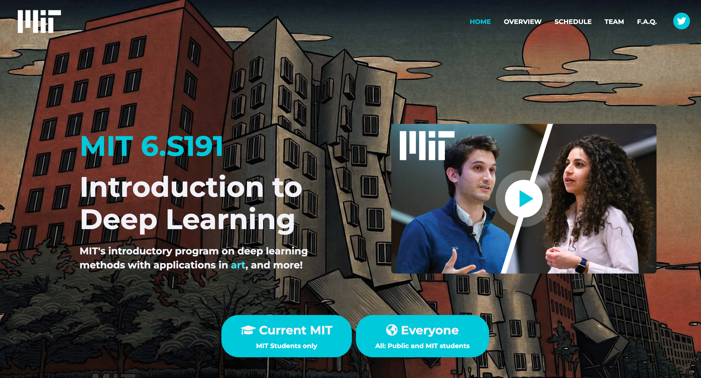

  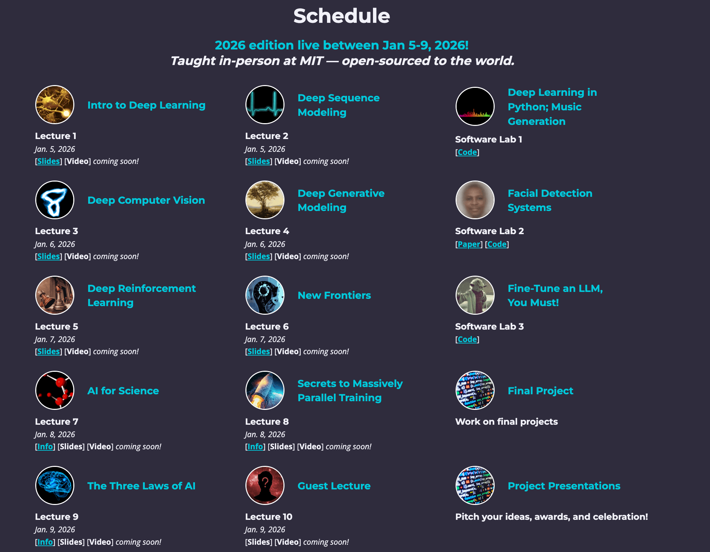

* **CS224N: Natural Language Processing with Deep Learning**
  - Stanford / Winter 2025 [[https://web.stanford.edu/class/cs224n/](https://web.stanford.edu/class/cs224n/)]
  - Stanford CS224N: NLP with Deep Learning | Spring 2024 | [[https://www.youtube.com/playlist?list=PLoROMvodv4rOaMFbaqxPDoLWjDaRAdP9D](https://www.youtube.com/playlist?list=PLoROMvodv4rOaMFbaqxPDoLWjDaRAdP9D)]
  
  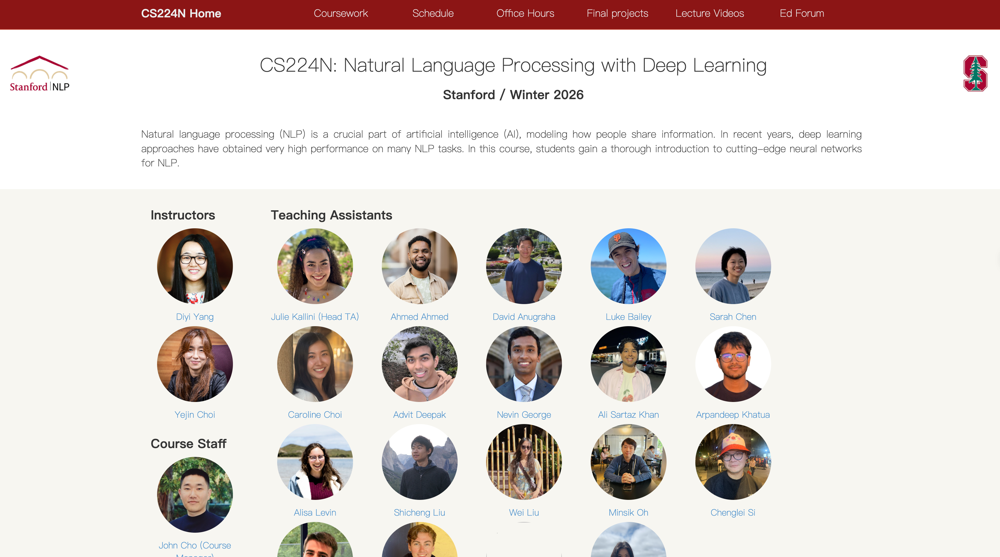
  
  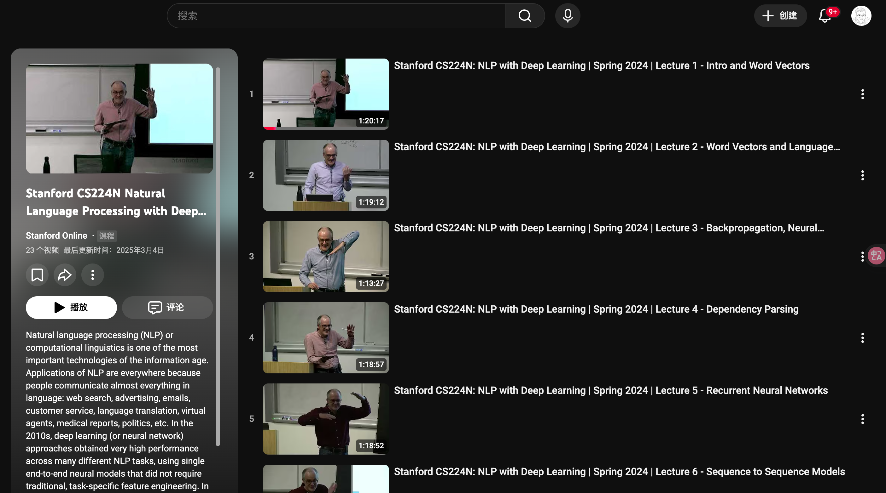
  
  
### 物理神经网络 PINN（新方向、新进展）
* [[PINN_Paper_List](https://github.com/Event-AHU/PINN_Paper_List)]
  
  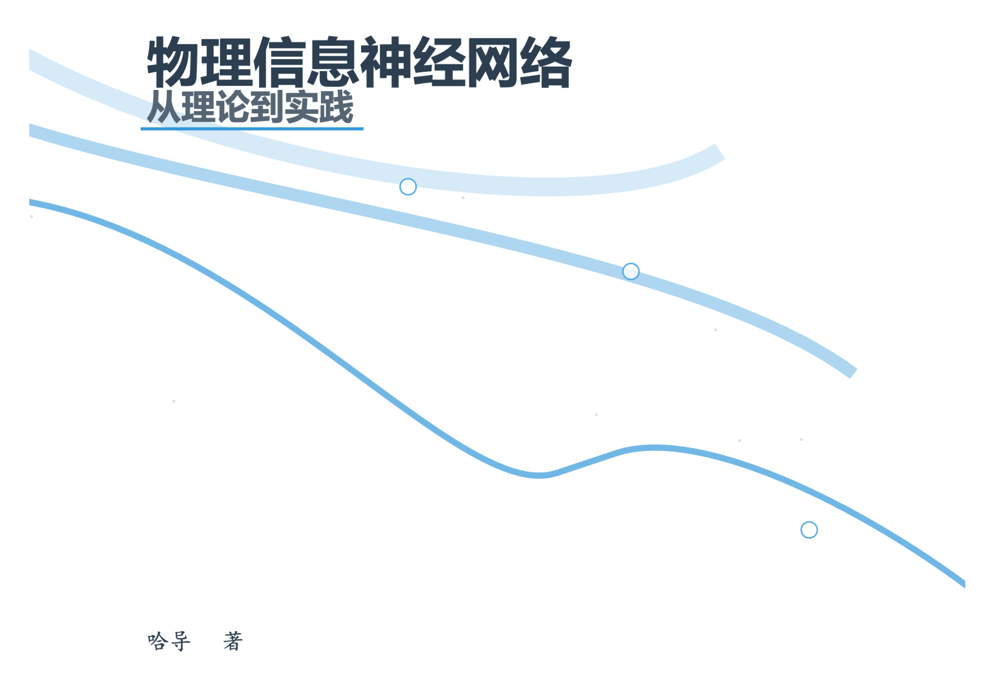 
  
  
### 深度强化学习 Deep Reinforcement Learning（不是所有人的 rl 都是 rl）
* **Stanford CS224R Deep Reinforcement Learning | Spring 2025**
  [[Youtube](https://www.youtube.com/watch?v=EvHRQhMX7_w)]
  [[cs224r.stanford.edu](https://cs224r.stanford.edu/)]
  
  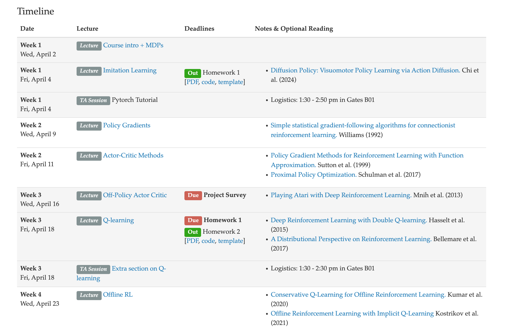 
  
  
* **Reinforcement Learning: An Introduction**, Second Edition, Richard S. Sutton and Andrew G. Barto
  [[PDF](https://www.andrew.cmu.edu/course/10-703/textbook/BartoSutton.pdf)]
  
  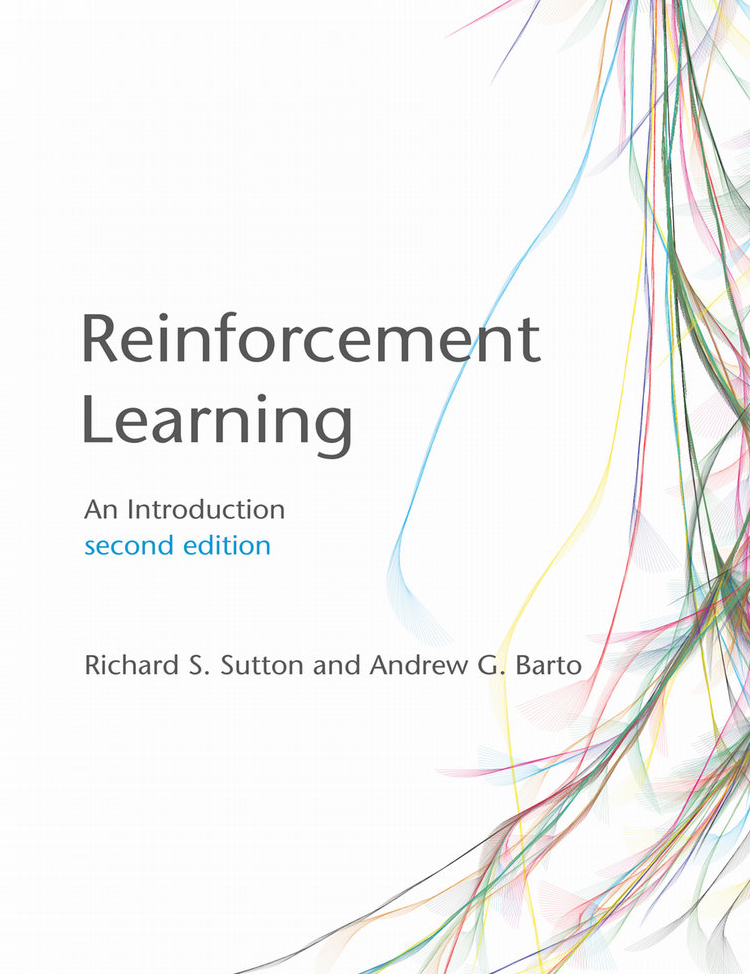

* **【强化学习的数学原理】Book-Mathmatical-Foundation-of-Reinforcement-Learning**, 西湖大学，赵世钰
  [[B站视频](https://www.bilibili.com/video/BV1sd4y167NS/?vd_source=309943935ab693366d5e9335381852f1)]
  [[GitHub](https://github.com/MathFoundationRL/Book-Mathematical-Foundation-of-Reinforcement-Learning)]
  
  
  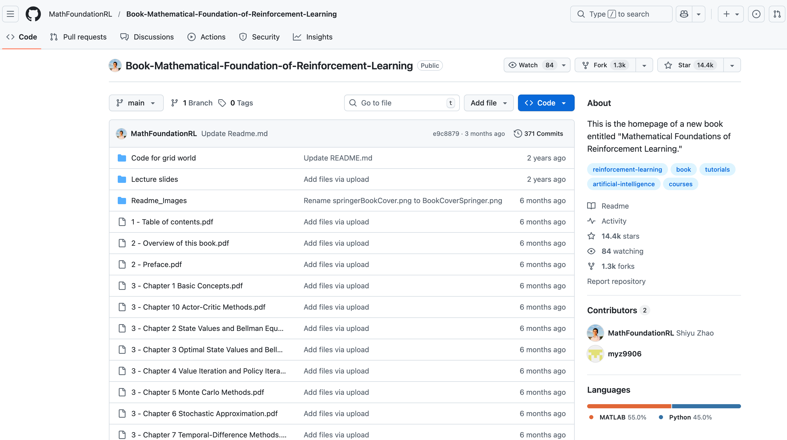 
  

